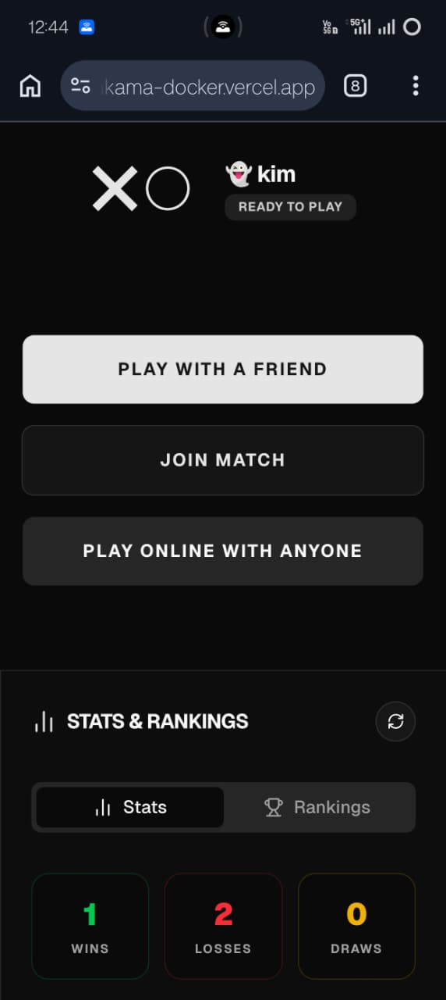
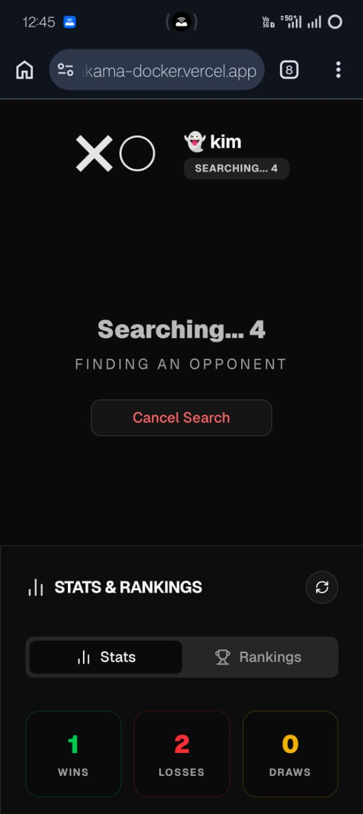
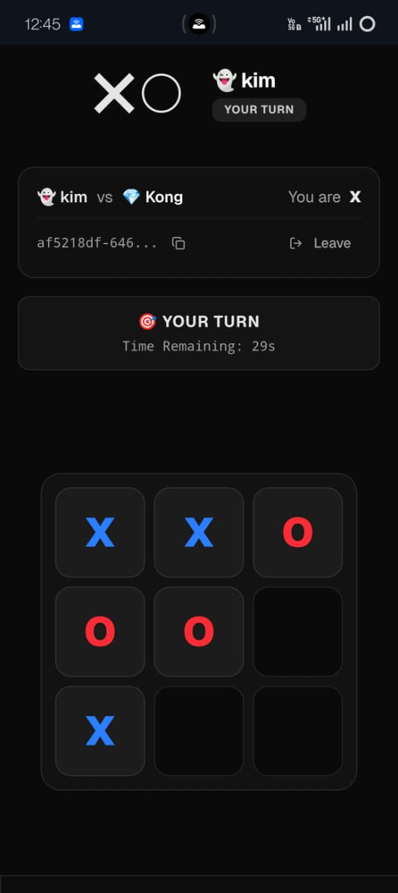
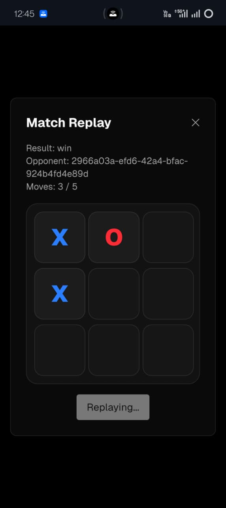
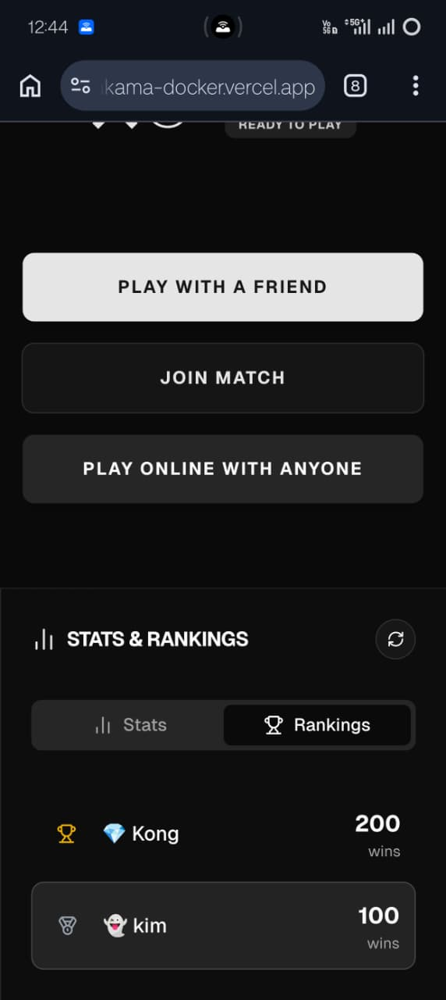
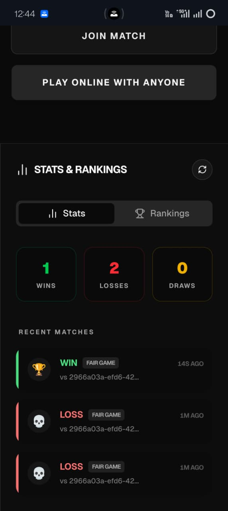

# Multiplayer Tic-Tac-Toe (Nakama-JS + TypeScript)

A production-ready, server-authoritative multiplayer Tic-Tac-Toe game built with **Nakama** and **React (TypeScript)**.

## Quick Links

- **[RUN.md](./docs/RUN.md)**: Local development and setup instructions.
- **[DEPLOYMENT.md](./docs/DEPLOYMENT.md)**: Details on the Railway (Backend) and Vercel (Frontend) deployments.
- **[API.md](./docs/API.md)**: Comprehensive guide to WebSocket Opcodes and RPC endpoints.
- **[ARCHITECTURE.md](./docs/ARCHITECTURE.md)**: Deep dive into the technical design and engineering decisions.

## Key Features

- **Server-Authoritative Gameplay**: All moves validated on the server to prevent cheating.
- **Real-Time Matchmaking**: Automated pairing using custom `start_time` synchronization.
- **Turn-Based Timeout**: 30-second move limit enforced by the backend.
- **Global Leaderboard**: Track player wins and compete globally.
- **Match History & Replays**: Review past games with a slow-motion playback of every move.
- **Mobile-Friendly UI**: Responsive design for a seamless mobile and desktop experience.

## Live URLs

- **GitHub Repository**: [https://github.com/manikanta5827/nakama-docker](https://github.com/manikanta5827/nakama-docker)
- **Frontend**: [https://nakama-docker-28ohfnz2x-manikantas-projects-05d5879c.vercel.app/](https://nakama-docker-28ohfnz2x-manikantas-projects-05d5879c.vercel.app/)
- **Backend (Nakama)**: [https://nakama.chilaka.online/](https://nakama.chilaka.online/)

## Screenshots

### Home Screen

### Matchmaking

### Ongoing Match

### Match Replay

### Global Rankings

### Player Statistics

